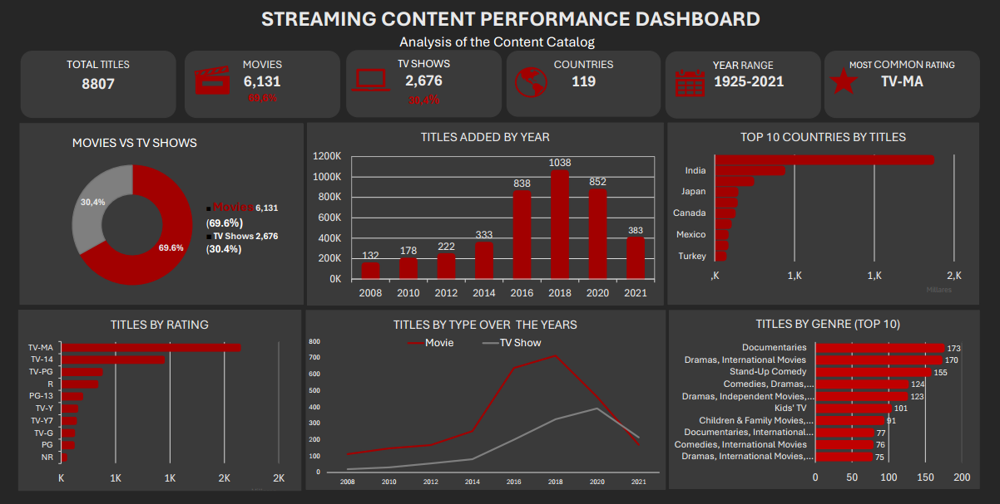

# Streaming Content Performance Analysis

## Project Overview

This project analyzes streaming platform content performance to identify audience engagement trends, top-performing titles, and insights that can support content strategy decisions.

The goal is to transform raw streaming data into meaningful business insights by analyzing content popularity, user engagement, ratings, and performance indicators using Microsoft Excel.

---

## Business Problem

Streaming platforms need to understand which types of content perform best in order to optimize their catalog, improve user engagement, and make data-driven decisions about future content investments.

This project explores content performance metrics to answer key business questions:

- Which genres generate the highest engagement?
- Which titles are the most successful?
- Do movies or series perform better?
- What factors influence content popularity?
- Which content categories could represent growth opportunities?

---

## Project Objectives

- Analyze streaming content performance metrics.
- Identify trends in audience engagement and content consumption.
- Compare performance across genres and content types.
- Discover top-performing movies and series.
- Create a dashboard to visualize key insights.
- Provide recommendations based on data analysis.

---

## Tools Used

| Tool | Purpose |
|------|---------|
| Microsoft Excel | Data Analysis and Visualization |
| Power Query | Data Cleaning and Transformation |
| Pivot Tables | Data Exploration and KPI Analysis |
| Excel Charts | Data Visualization |
| Dashboard Design | Business Insights Presentation |

---

## Dataset Information

The dataset used in this project is a simulated streaming platform dataset created for analytical purposes.

It includes information about:

- Content titles
- Content type (Movie / Series)
- Genre categories
- Release year
- Country
- Views
- Watch time
- Ratings
- Completion rate
- Audience engagement metrics

---

## Key Metrics Analyzed

The analysis focuses on the following performance indicators:

- Total Content Titles
- Total Views
- Total Watch Time
- Average Content Rating
- Completion Rate
- Performance by Genre
- Performance by Content Type
- Top Performing Titles

---

## Dashboard Preview

---

## Key Insights

The analysis revealed important patterns related to content performance and audience behavior:

- Identified the highest-performing content categories based on views and engagement.
- Compared performance differences between movies and series.
- Analyzed audience retention through completion rates.
- Highlighted top-performing titles with strong viewer engagement.
- Discovered trends that can support content investment decisions.

---

## Business Recommendations

Based on the analysis, the following recommendations were identified:

- Prioritize investment in high-performing genres with strong audience engagement.
- Use viewer behavior insights to improve content acquisition strategies.
- Monitor completion rates to evaluate content quality and user satisfaction.
- Develop targeted strategies for increasing audience retention.
- Continuously track content KPIs to support data-driven decisions.

---

## Skills Demonstrated

- Data Cleaning
- Data Analysis
- Content Analytics
- KPI Development
- Excel Dashboard Creation
- Data Visualization
- Business Intelligence
- Data Storytelling

---

## Project Status

Completed
